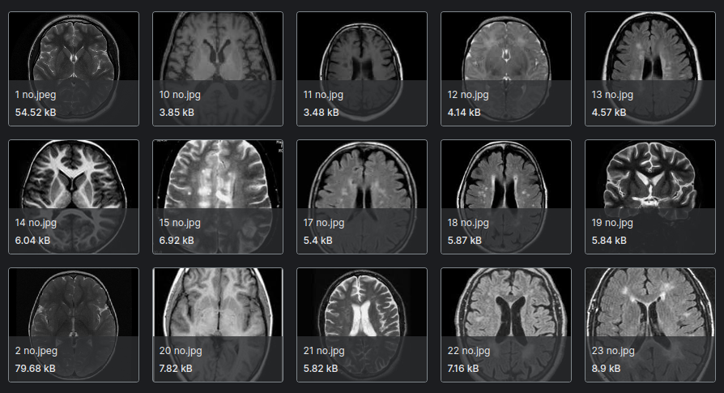
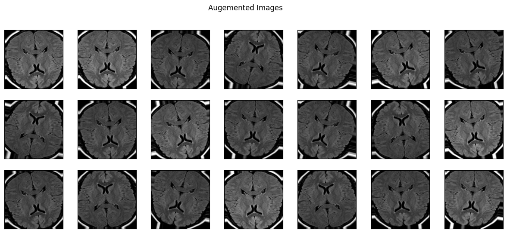
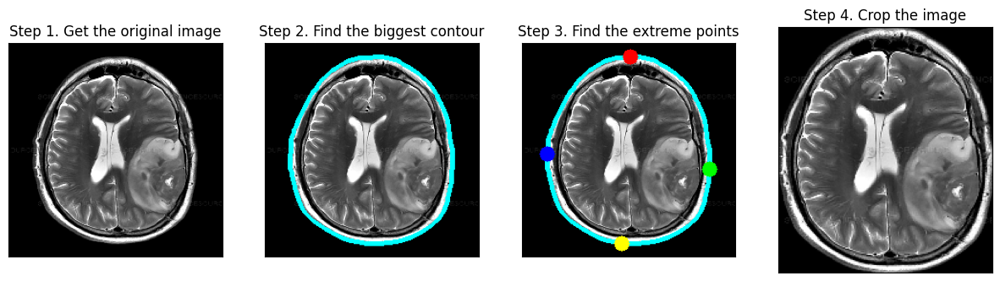
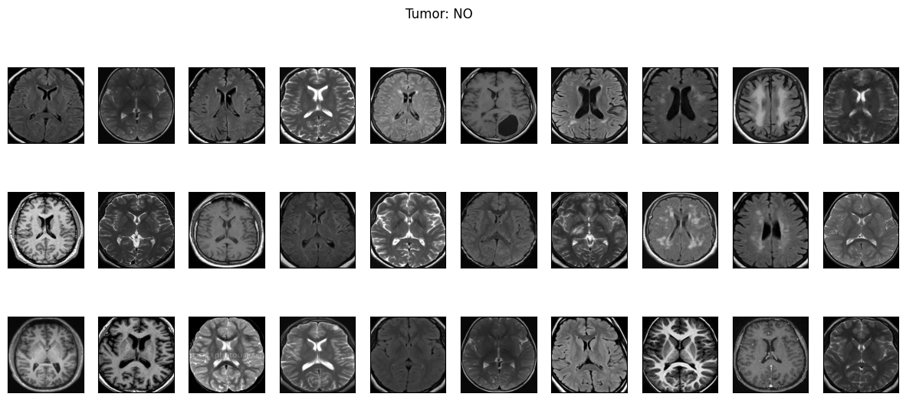

# Brain-Tumor-Detection-v1.0-CNN-VGG-16-
Introducing Brain Tumor Detection v1.0, powered by CNN and VGG-16. This advanced model accurately identifies brain tumors from MRI scans, aiding early diagnosis and treatment planning. Experience the fusion of deep learning and medical imaging to revolutionize healthcare.
Brain Tumor Detection v1.0 is an advanced machine learning model designed to identify brain tumors from MRI scans. Utilizing Convolutional Neural Networks (CNN) and the VGG-16 architecture, this project aims to aid early diagnosis and improve treatment planning through accurate and efficient tumor detection.

### Dataset aggregation

## Features
- Accurate brain tumor detection from MRI images
- Utilizes deep learning techniques for robust performance
- Easy-to-use interface for medical practitioners and researchers

### Augmentation View

### Methodology

### Results

## Technologies Used
- Python: Core programming language
- TensorFlow: Framework for deep learning
- Keras: High-level neural networks API
- VGG-16: Pre-trained CNN model for feature extraction
- OpenCV: Image processing library
- NumPy: Numerical computing library

## Contributing
Feel free to contribute to the project by submitting issues or pull requests. Please ensure that your contributions adhere to the project's coding standards and guidelines.

## License
This project is licensed under the MIT License
